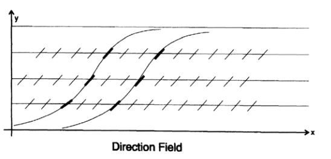
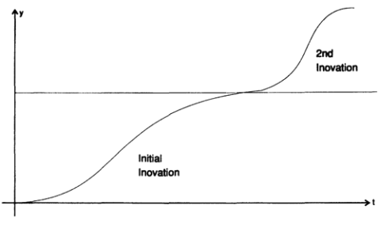

# 02-数字化基础（离散信号）

从连续信号传输到离散脉冲信号传输的革命已近尾声，而今离散信号传输的基础可能正在从使用脉冲信号转向使用孤子。自然界中许多信号都以连续形式出现（如果忽略分子、电子组成物体离散结构事实的话），例如，电话语音、乐声、身高、体重、行驶的距离、速度，密度等都是连续信号的例子。目前，我们通常在采集到连续信号之后就立即进行采样，转换为离散信号，采样方式通常是等时间隔，信号的振幅值被量化为少数的几个等级。在本章中，我们先不管量化问题，这不意味着量化不重要，比如对数字进行大规模计算时，量化就很重要。

连续信号转换成离散信号的革命为什么会发生呢？

1、连续信号传输过程中，沿途会有自然损耗，于是就不得不放大信号来补偿，于是中间某个阶段要是产生了误差，就会在下一个放大阶段被放大。例如，电话公司在洲际之间传输语音信号时，总共大概要放大$10^{120}$倍。一开始，这个倍数看起来非常大，于是我们来进行一下所谓的信封背面计算，看看这个倍数是不是合理。考虑得再详细一点，如果每一阶段的放大器增益是100，每隔50英里放一个放大器，信号传输实际路径大概是3000英里，因此需要大约60个放大器，考虑到它的产生方式，看上去上述放大倍数是合理的。显然，这些放大器精度要足够高，才能实用。

如果传输离散信号，每一个阶段不是放大信号，而是利用输入脉冲来控制是否打开一个标准的脉冲源，实际上我们使用的是中继器而不是放大器。如果在某个阶段引入了噪声，但又不至于在下个中继器处使脉冲检测出错，那么这些噪声相当于被自动消除了。因此，如果使用数字信号传输语音信号，就能实现惊人的保真度，而且设备不需要特别高精度。如果有必要，我们可以使用错误检测机制和纠错码来进一步消除噪声。我们会在10-12章研究这些纠错码。与此同时，我们还发展出了数字滤波器领域，数字滤波器通常比模拟滤波器更为多样、紧凑且便宜，第14-17章讲讨论这些领域。这里还应注意，跨越空间的传输（通常是信号传输）和跨越时间的传输（也就是存储）是相同的道理。

数字计算机可以利用这些特性，进行非常深度非常精确的计算，这是模拟计算无法企及的。模拟计算机已经走到头了，但也不应该被轻易忽视，它们有一些特征，使其在不需要极高精度或深度计算的情况下，在某些场景下性能也很理想。

2、晶体管和集成电路的发明大大推动了数字革命。集成电路出现之前，焊接点的问题是制造大型计算机的主要难题，而集成电路则消除了大部分焊接点的问题，尽管焊接点问题仍然令人头疼。此外，集成电路中高密度的元件还意味着更低的成本和更高的计算速度（元件必须彼此靠近，否则信号传输时间将显著降低计算速度）。电压和电流水平持续降低也对解决散热问题有一些好处。

3、社会正在从物质商品社会转向信息服务社会。在美国独立战争期间，比如说1780年左右，超过90%的人都是农民，而现在农民只是小比例。二战之前，大多数人都在工厂工作，现在只有不到一半的人在工厂工作。1993年，政府工作人员（不含军队）人数已经超过了制造业工人了！到2020年情况会怎么样？我猜不到25%还会从事实物类工作，其余的人都以某种形式处理信息（本书出版于1997年，译者此刻是2024年10月28日，我刚刚问了Chat GPT，2020年美国的制造业工人占比8%）。制造一部电影或者一档电视节目，尽管它有实物形式（光盘等），实际上并不是在制造一个实物，而是在组织信息。信息当然存储在物质形式中，比如书籍（书籍的本质是信息），但是信息不是像实物、房屋、衣服、汽车、飞机交通服务那样被消费的物质商品。

信息革命（前文所说的数字革命）源起这三者的共同作用。当然，还有一些因素也有贡献。

4、计算机使得机器人可以完成许多事情，包括当前的大部分制造工作。显然机器人的核心是计算机，但是我们不能简单地认定冯诺伊曼计算机是唯一的控制装置，实际上就目前的神经网络计算机、模糊集合逻辑及其变体将很可能承担大部分控制任务。孩子们眼中的机器人和人差不多，我们不要这么看，我们应该将机器人看作是物质世界中处理和控制事物的一种设备，制造业中使用机器人会有如下效果：

- 提高标准可以生产更好的产品
- 通常都能生产出更便宜的产品
- 生产出不同的产品

最后一点要尤为关注。

当我们从手工记账转向使用计算机记账时，仅从经济角度考虑，也应该对会计系统做一些改动。同样的逻辑，当我们从严格的手工制造转向机器制造时，我们从主要使用螺丝和螺栓转向使用铆钉和焊接。

用机器生产出和手工制品完全相同的产品往往无法实用。

事实上，从手工生产转型为机器生产，最重要的步骤之一就是保持产品本质不变，生产等效产品，这需要依靠丰富的想象力重新设计。因此，如果考虑将一个大型组织机械化，试图完全保持事物的每个细节和原来一模一样就行不通，而是需要更大的灵活性和妥协，才能转型显著成功。必须得牢记工作的本质，然后设计机械化流程来完成符合本质的工作，而不是死板地照搬当前工作，那样是无法取得长期显著成功的。

我得强调这一点：机械化要生产的是等效的产品，而不是完全相同的产品。此外，在任何设计中，都要考虑到维护工作，拉长时间来看，维护工作往往是成本之首。设计的系统越复杂，就必须越加考虑到未来如何维护，而且这要成为最终设计的核心。只有当未来现场的维护也是最初设计考虑的一部分时，才能安全地控制整个系统；事后打补丁维护的做法并不明智。这既适用于机械设备，也适用于人类组织。

5、计算机对科学的影响非常大，随着时间推移，这种影响可能还会持续下去。我第一次接触大规模计算是在洛斯阿拉莫斯设计原子弹时，但是没有进行小规模试验的可能性——要么有一个临界质量，要么没有，因此计算机是当时看来唯一可行的方法。我们在原始的IBM记账机上模拟了各种待讨论的设计，逐步确定了在最终在新墨西哥州阿拉莫戈多沙漠进行测试的设计。

从那次经历中，经过仔细思考其中的意义，我意识到计算机可以用于模拟许多不同的实验。我将这一愿景付诸实践，在贝尔实验室工作了许多年。在1950年代中后期，有一次给贝尔实验室总裁和副总裁的汇报中，我说：“目前我们在计算机上做一次实验，在实验室里做9次实验，但是等我离开时，这个比例会反过来。”当时他们不信我，因为他们确信实际观测才是实验的关键，而我只是一个数学部门的狂热理论家而已，后来的事你们都知道了，那就是我们大约90%到99%的实验是在机器上进行的，剩下的才在实验室进行。这种趋势将会继续下去，模拟实验比真实实验便宜得多，测试时也更加灵活，甚至可以完成实验无法完成的事情，因此这是大势所趋。还是那个观点，产品已经发生了变化。

中世纪经院哲学的弊端你们都了解过，那就是通过阅读亚里士多德（公元前384-322）的著作来推测结果，而不是通过观察自然现象。而伽利略的伟大之处在于，他提倡观察自然，而不是只看书，这掀起了现代科学革命！我前面好像讲过，我们现在更多在书本中寻找答案，观察自然则越来越少。明显我们有时候会过犹不及，估计这种情况会随时发生。未来在计算机模拟的世界里流连忘返，我们也绝不能忘记，偶尔也要看看这个世界本来的样子，那是自然的样子。

6、计算机也极大地影响了工程学。我们不仅可以设计和制造出比手工复杂得多的事物，还可以探索更多的替代设计方案。现在我们也可以使用计算机来控制一些情况，例如现代高速飞机的设计中，专门构建一些不稳定的情况，然后通过高速检测和计算机来使其稳定，因为单凭飞行员自身无法直接操控这些飞机。同样地，我们现在可以在实验室中使用高速计算机来控制不稳定的实验，从而使实验可以在接近稳定的边缘情况下非常精确地测量某些东西。

如上所述，工程学正逐渐接近科学，因此对于未探索的情境，模拟在工程学和科学中都越来越重要。计算机也往往是良好设计的重要组成部分。

以前的工程学，主要是围绕“我们能做什么”进行，但现在“我们想做什么”就变得更重要，因为现在有能力设计几乎任何我们想要的东西。工程学是一种关乎选择和平衡的事情，不仅仅是做可做的事，这一点比以往任何时候都重要。而且，优秀的设计越来越取决于人，这一点需要你们要时刻认真关注。

7、计算机对社会的影响也很大。最明显的例子就是计算机可以赋予高管微操的权力，也就是微观管理，而高管几乎不会拒绝这种权力。你可能经常在报纸上看到大公司宣布要去中心化，实际上几年之后再去看，也都是说说而已，没有真正做到。

微操有一个弊端，会造成一线管理者没有机会做出负责人的决策，和从决策错误中学习成长，当年长的高层管理者退休时，一线管理者发现自己成了高管，却没有多少真正的管理经验。

还有，中央计划已经反复证明效果不佳（看看苏联的经验，或者我们自己的官僚体制就知道了）。身处一线的人通常比高层更了解实际情况，因此，只要不受到高层的微操管理，他们往往（并非总是）能做出更好的决策。虽然一线没有全局视角，但高层更无法掌握细节，而许多细节往往非常重要，重要到任何一个极端情况发生都会导致不良后果。

再加一条，一手的工作经验而在工作现场产生的想法，在一个中央控制系统中是无法落地的，因为这个想法不是管理者自己的。“非我所创”综合症（NIH，Not Invented Here）是我们社会的症状之一，计算机使管理颗粒度变得更细则加剧了这种症状。

为了对抗微观管理，小型、相对独立的组织之间正在形成松散的联系，这正在渐渐形成趋势。例如，在经纪业务中，有一家公司专门向其他小型公司提供计算机和法律之类的服务，这就让经纪决策可以留给那些更接近一线的管理人员了。同样的例子也发生在制药业，有一些松散相关的公司各自独立开展工作，并根据需要相互交易。我相信，小型组织之间形成松散联盟的现象会越来越普遍，目的是应对大型组织的中高层的微观管理。组织内部的分支机构本身一直都具有一定的独立性，但是高层的微观管理能力显然破坏了这种独立性，是否有高管能够长时间抵挡得住微操的诱惑，我很怀疑。我也怀疑大公司能不能完全放弃微观管理，大多数公司可能最终会被小型组织所取代，因为他们没有高管成本，且决策错误少。所以说，计算机正在影响整个社会的商业结构，目前来看，似乎是一种不利的影响。

8、计算机也侵入到了娱乐领域。一项非正式调查显示，普通美国人看电视的时间远远超过吃饭时间——信息消费再次优先于吃饭这一重要的物质消费！许多广告和一些节目已经部分或者全部由计算机制作完成。

机器改变社会，到底能改变成什么样子，仍然扑所迷离，公开讨论这个问题甚至会引来发麻烦！所以，你们自己可以畅想一下，搭载芯片的计算机在人类活动中可以做到什么，比如性，婚姻，体育，游戏，用VR在家旅行。

计算机最初主要应用于数字计算，但很快就扩展到信息检索（例如航空公司的预订系统）、正在迅速普及的文字处理，还有许多符号操作程序，做微积分比学生做得又快又好，以及分析和决策，许多公司都使用这些程序来试试控制他们公司的运营。计算机未来对传统领域的侵入还有待观察，6-8章的人工智能我会再进行讨论。

9、在军事领域，信息的核心作用显而易见，比如海湾战争，未能利用自身信息则会导致很多人员伤亡！海湾战争首先是一场信息战，不用我说你们都能意识到，这大概就是未来的趋势。试着想一想2020年的画面，那时候正是你们的职业黄金时期，计算机应该无处不在，因为我曾看到一处标语“战场不是人类的地方”，需要频繁做决策的地方更不应该是人类的地方。上一章的末尾我列举了机器相对于人类的许多优势，这些优势都非常明显，尽管并非所有优势。

显然，未来人类的角色与传统角色截然不同，但是你们中许多人会坚持固有思维，想当然觉得过去的理论在未来也成立。商业亦如此，现在教授的内容都来自过去的总结，忽视了计算机革命及其带来的弊端，管理层通常对其带来的收益很清楚，但对弊端却不太了解。

第6部分谈及的微观管理趋势，无论是越来越接近还是远离，能在多多大范围内应用，再次成为一个留给你们自己的话题，但是如果你不对这个话题进行深入和持续的关注，非常不明智。我建议你必须重新思考这一主题的所有内容，质疑既有的所有教条，最终自己决定其在未来的适用性。佛陀告诉他的弟子：“无论在哪里读到，谁说的，甚至如果是我说的，除非符合你自己的理性和常识，否则不要相信。”同样的话我也给你们说一遍，你们必须为自己的信仰负责。

现在我来聊一个经常被忽视的话题，那就是某些特定领域的进化速度，我会将其作为信封背面计算的另一个例子。大多数（但绝不是所有）领域的增长都遵循“S”曲线，事物开始缓慢，随后迅速上升，最后在遇到一些自然限制后趋于平缓。

最简单的增长模型可以假设增长率与当前规模成正比，复利增长、不受限制的细菌增长和人类人口增长以及其他许多例子都符合这个模型。对应的微分方程是：

 $\frac{\mathrm{d} y}{\mathrm{~d} t}=ky$

其解为：

$y(t)=A e^{kt}$

但是这个模型下的增长是无限的，而所有增长都有极限，甚至知识本身也是如此，因为它必须以某种形式被记录，而宇宙是有限的！因此，我们必须在微分方程中加一个限制因子。设L为上限，那么下一个最简单的增长方程就是：

$\frac{\mathrm{d} y}{\mathrm{~d} t}=k y(L-y)$

在此处，我们当然可以将其简化为消除常数的标准形式。设  $y = Lz ， x = t/kL^2$ ，则有：

$\frac{\mathrm{d} z}{\mathrm{dx}}=z(1-z)$

这是简化后的增长问题形式，其中饱和值为1。通过分离变量加上部分分式，我们得到：

$\begin{aligned}
\ln z-\ln (1-z) & =x+C \\
\frac{z}{1-z} & =A e^x \\
z & =\frac{1}{\left[1+(1 / A) e^{-x}\right]} .
\end{aligned}$

常数A由初始条件决定，即当你取t=0或x=0时确定。你可以立即看到曲线的S形状；当  $t = -\infty$  时， $z = 0$ ；当  $t = 0$  时， $z = A/(A+1)$ ；当  $t = +\infty$  时， $z = 1$。 

对于增长，简化变量得到更灵活的模型：

$\frac{\mathrm{d} z}{\mathrm{d} x} = z^a (1 - z)^b, \quad (a, b > 0)$

这同样是一个可分离变量的微分方程，可以通过数值积分求解。我们可以通过对右侧求导并令其为0来找到最陡斜率。我们得到：

$a (1 - z) - b z = 0$

因此在位置

$z = \frac{a}{a + b}$

我们有最大的斜率

$\frac{a^a b^b}{(a + b)^{a + b}}$

方向场草图如图2-I所示，通常可以用来指示解的性质，特别指出的是，斜率只取决于y而不是x时——同一水平线处不同曲线的斜率一样，因此可以沿着横轴滑动解而不改变解的形状。对于给定的a和b，实际上只有一个形状，初始条件决定了你观察的位置，而不是你观察的对象。当微分方程的系数不依赖于自变量时，就会有这种效果。

图2-I 方向场

在特殊情况下，当a=b时，我们有：

$\text{最大斜率} = \frac{1}{2^{2a}}$

在这种情况下，曲线将在  $z = 1/2$  的点左右对称。

在更特殊的情况下，当  $a = b = 1/2$   时，我们得到解：

$z = \sin^2\left(\frac{x}{2} + C\right), \quad (-C \leq \frac{x}{2} \leq \pi - C)$

在这里，我们看到解曲线有一个有限的范围。对于更大的指数  a  和  b ，显然有一个无限的范围。

举一例子来说明上述估算的实际应用，计算机主频增加速度多年来一直相对恒定，因此我们显然处于S曲线的几乎直线的部分（下一章会有更多相关内容）。在这种情况下，我们可以或多或少知道冯诺伊曼单处理器类型计算机的饱和值，因为我们相信：1）世界由分子构成；2）根据狭义和广义相对论提供的证据，有一个有用信号传输的最大速度，因此单处理器能实现的极限是确定的。高度并行处理器的发展趋势说明我们已经感受到了单处理器计算机的S曲线上限。当然也存在散热的棘手问题，下一章会详细讨论。

再一次看到，一个简单模型虽然在细节上不够精确，但足够提示出情况的性质。并行计算是否符合这一模型，或是独立的一条曲线，尚不清楚。通常来说，一项新的创新，将使一个领域进入一个新的S曲线，这条曲线从旧曲线的饱和值附近开始起飞，如图2-II所示。你可能希望探索那些没有硬性上限而最终呈对数增长的模型，他们有时候更合适。

图2-II

显然，未来的电气工程很有可能会是：1）从货架上或者商品目录中选择芯片，2）以合适的方式组合芯片以实现你的目标；3）为你的芯片编写程序。了解当前可用芯片和电路板将是工程学的重要部分，就是以前的真空管目录一样。

最后再说一点我在这个领域的观察，就是专用的集成电路芯片。为某个特殊需求设计专用芯片当然效果会非常好，但这会带来非常高的成本。首先，当然是设计成本，接着是芯片的故障排查成本。相反，如果通用芯片能满足需求，尽管会稍微贵一下，但它有如下优势：

其他芯片用户也会协助发现错误或其他弱点。

其他用户也会协助编写芯片使用手册。

其他用户包括制造商，会给芯片升级提建议，因此你可以预期有源源不断的芯片改进计划，而自己不需要付出任何额外努力。

库存将不再是一个严重的问题。

正如我反复说的，技术进步的速度正在加快，这意味着未来的技术进步淘汰速度将远远超过现在。可能还没等你把系统装好投入正常使用，就有人把应用程序做一些修改就达到同样目的了。如果你用的是通用芯片而不是最初设计的专用芯片，那么几乎可以肯定的是，你不会被束缚在最初设计上。

因此，要小心使用专用芯片！

尽管很多时候确实也是必不可少的。
