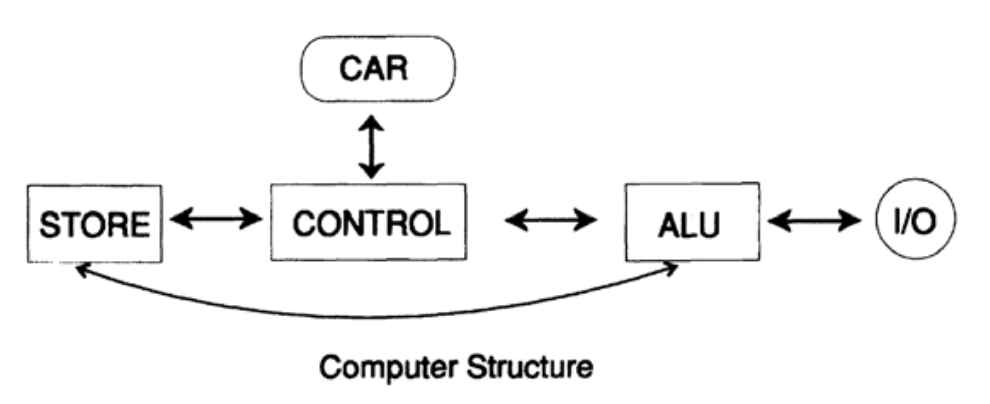

# 03-计算机简史-硬件篇

计算的历史可能最早追溯到原始人用鹅卵石计算两个数量的和。哈佛的马沙克发现，原本简单地以为是旧骨头上的划痕，其实是与月相有关的线条，精心刻上去的。位于英格兰索尔兹伯里平原上的巨石阵很著名，它有三个建造阶段，公元前 1900-1700 年、1700-1500 年和 1500-1400 年，这三个阶段显然与天文观测密切相关，这表明当时人们对天文已有相当深入的理解。考古天文学研究表明，许多原始民族的天文知识都非常丰富。中国、印度和墨西哥在这方面尤为突出，人类至今都保留着有关的建筑物，现在叫做天文台，但今天的人们对它们的使用方式已知之甚少。美国西部平原上也有天文观测遗迹，那是印第安人留下的。

沙盘和算盘都与计算更加密切，从印度传来的阿拉伯数字则是纯计算领域的一大进步。使用阿拉伯数字遭到了当局的强烈反对，甚至还会被认为是非法行为，但是随着时间推移，到了15世纪，它靠实用性和经济优势完全取代了罗马数字，因为罗马数字太笨拙了，也取代了希腊人早期作为数字符号而使用的字母。纳皮尔（1550-1617）发明的对数以及由此发明的对数尺又是一大进步，对数尺上数字的长度与这些数字的对数成比例，因此两个长度相加意味着两个数字相乘。这台模拟设备（对数尺）是一个重要进步，但属于模拟计算机的进步而不是数字计算机。我曾经使用过一个非常精密的对数尺，是一个圆柱体，直径6-8英寸，高约两英尺，圆柱体内外有许多对应的刻度，配合放大镜使用可以提高读数精度。20世纪30-40年代，对数尺是工程师的标配，通常装在一个皮套里，别在腰带上，走在校园里，是身份的象征。工程师标准的对数尺是“10英寸log-log十进制对数尺”，它有10英寸长的刻度、平方和立方刻度，还有十进制表示的多个三角函数。现在这些工具已经停产了！

沿着模拟这条方向，接下来关键的发明是微分分析仪，最早还有机械形式的模拟积分器。最早成功应用的微分分析仪是MIT的范内瓦·布什于1930年左右制造的。此后不久又出一个版本RDA #2，还是模拟的，主要是机械结构，也有大量的电子连接。我曾经在1947-1948年间使用它来计算Nike导弹的弹道。

在二战期间，电子模拟计算机开始用于军事，采用电容器作为积分器，代替了之前的机械轮和球（因此只能对时间进行积分）。这实际上进了一大步，我在贝尔实验室使用过很多年的一台机器，就是这样的机器，由一些旧 M9 炮兵指挥器的部件组成。实际上实验室还有一台计算机，也是使用一些 M9 部件组装而成，我们有时候独立使用，有时候与第一台结合使用，一起解决更大的问题。

再讲回数字计算，对数发明者纳皮尔，还设计了一个叫做“纳皮尔的骨头”的东西，所谓骨头通常是象牙棒，上面标有数字，可轻松地进行乘法运算；这些已经属于数字设备了，与模拟的对数尺原理不同。

纳皮尔的骨头可能是后来更现代的台式计算器的祖先了。1623 年 12 月 20 日，席克特写信给著名的天文学家开普勒，称实验室的一场火灾烧毁了他为开普勒制造的机器。他的记录和草图表明，该机器能够进行四种基本的算术运算，当然其中的乘法和除法运算有点差强人意。同年出生的帕斯卡尔（1623-1662）经常被认为是台式计算器的发明者，但他的机器只能进行加减法，因为他的发明只是想用来帮助他父亲评估税收。莱布尼茨（微积分发明人之一）也尝试过制造计算机，并加入了乘法和除法功能，但他的机器可靠性较差。

数字计算史上必须得有巴贝奇（1791-1871）一席之地，堪称现代计算的奠基人。他首先设计了一台差分机，想法其实很简单：一个多项式可以通过在连续的等间隔值上一系列的加减法计算出来，因为从有限精度来看，大多数函数都可以用相应的多项式表示，这样就可以生成一个由“机器制作的表格”（巴贝奇坚持用机器进行打印，以防止参杂任何人为错误），通过查表完成计算。英国政府赞助了他制造这台差分机，但他没有完工。挪威的一对父子（Scheutz）根据他的图纸成功造出了几台，巴贝奇祝贺了他们的成功。其中一台还卖给了纽约州的奥尔巴尼天文台，用于制作天文观测表格。

差分机还没完工，巴贝奇又构思了更强大的分析机，计算领域经常发生这样的迭代，这台分析机与今天我们用的冯·诺依曼计算机思路非常相似。无独有偶，这台机器巴贝奇仍然没能完工，1992 年，英国的一个团队根据他的设计图纸造出来了一台机器，而且还成功地使用了它！

接下来真正有用的是“计数仪”，只是一个加法装置，通过重复加法和移位，这相当于乘法，应用非常广泛，用了很多年。

之后出现了一系列更现代的台式计算器，如“百万富翁”、Marchant、Friden 和 Monroe。最初它们完全靠手动控制和驱动的，但逐渐引入了机械杠杆，从 1937 年起更是逐渐配备了电动机，给计算过程提供大部分动力。在 1944 年之前，就已经有可用于开方的计算机器，但仍然通过复杂的机械杠杆实现。那时候主要依靠计算小组提供计算能力，而这些手动计算器则是计算小组的必备工具。我 1946 年来到贝尔电话实验室时，实验室里有四个计算小组，通常每组大约六到十人，都是女孩。数学部门有一个小组，网络部门有一个大组，交换部门有一个，还有一个是质量控制部门。

穿孔卡计算的发明缘于某位有远见的人，这个人发现，法定每十年一次的联邦人口普查非常费时，很可能下一次（1890年）普查开始的时候，上一轮还没结束，所以必须得转向机器化方法。霍列里斯接手了这个任务，构建了第一台穿孔卡机，随着一次又一次人口普查进行，他制造了更强大的机器来应对不断增长的人口和问卷的问题量。1928年，IBM开始使用带有矩形孔的卡片，这样电刷可以很容易地检测卡片上特定位置是否有孔。曾经在人口普查小组工作过的鲍尔斯，保留了圆孔形式的卡片，圆孔卡片由机械棒检测，大家戏称为“手指”。

大约在1935年时，IBM制造了能进行乘法运算的601机械穿孔机，还能将两个加法同时包含在乘积中。这台机器成为计算领域的顶梁柱，大约有1500台在被出租使用，一次乘法运算大约2-3秒。这些机器，以及一些特殊的三重乘积和除法机器，在洛斯阿拉莫斯都被用于设计过原子弹。

乔治·斯蒂比兹于1939年用继电器制造了复数计算机，于1940年在达特茅斯展出，当时主机位于纽约，因此可以说它是早期的远程终端了。此外，它通常有三个输入站，分布在实验室的不同位置，所以我们还可以说它已经具备“分时复用”特征了。

除了乔治·斯蒂比兹，德国的康拉德·楚泽，哈佛的霍华德·艾肯，也都各自生产了一系列复杂度不断增加的继电器计算机。斯蒂比兹机器的第五代，一台机器内装了两台计算机，在需要时可以共同完成一个任务，堪称“多核”了。他们三人，可能楚泽的成就最大，他虽然面对很多困难，但后来对计算机软件方面的贡献很大。

通常认为电子计算机时代始于1946年的ENIAC，这是一台为美国陆军建造的计算机。它有约18,000个真空管，体积巨大，原本的设计是类似IBM插线板，但描述某些特定问题时，连线能绕满整个机房！如果用于弹道轨迹计算，只要按照最初的设计操作，这种缺陷就不严重。最终它被用户巧妙地重新排列，像极了使用指令编程，而不是通过连线编程，指令就是弹道表上的数字，这跟后来的IBM CPC一样。

制造ENIAC的是毛克利和埃克特二人，他们和巴贝奇一样，在第一台机器还没完工，就构思了更大的机器EDVAC，可以内部编程。冯·诺依曼是该项目的顾问，撰写了报告，因此内部编程的设计常常归功于他，据我所知，他对这一功劳未承认也未否认。1946年夏天，毛克利和埃克特开设了一门课程，面向所有人，讲授如何设计和制造电子计算机，许多参与了这门课程的人都开始制造自己的计算机；英国剑桥的威尔克斯是第一个使机器有效运行的人，他造的计算机叫EDSAC。

早期每台机器都是独一无二的，许多机器都是仿造普林斯顿高等研究所（冯诺伊曼领导）的机器，但都比普林斯顿的机器提前完工，因为普林斯顿高等研究所的这项工程似乎被搁置了。例如由N.C.梅特罗波利斯指导建造的Maniac-I（1952），是在高等研究所的机器之前完成的。Maniac-I和Maniac-II（1955）在洛斯阿拉莫斯建造，而Maniac-III（1959）则在芝加哥大学建造。联邦政府，特别是美国军方，在促进计算机革命方面居功至伟，因为他们支持了大多数早期的计算机制造。

毛克利和埃克特还领导了第一台商用电子计算机的生产，他们创办的公司与另一家公司合并，他们生产的机器最终被称为UNIVACS。最有名的是为人口普查局建造的一台计算机。不久之后，IBM推出了18台（如果算上加密用户则为20台）IBM 701。我清楚地记得有一次参加IBM 701的会议，我们一群人对这18台机器议论纷纷，都认为这完全够整个市场使用很多年了！我们只想到了当时正在做的那些事情，而没有想到机器的全新应用领域。当时的顶尖专家完全错了！而且大错特错！而且不止错这一次！

我来对运算速度做一些比较：

```markdown
•	手持计算器：每20秒1次运算
•	继电器机器：每秒1次运算（典型值）
•	磁鼓机器：每秒15-1000次运算（具体取决于定点还是浮点运算）
•	701型机器：每秒1000次运算
•	当前（1990 年）的机器：每秒 10^9 次运算（接近冯·诺依曼型机器中的最快速度）
```

我所经历的运算速度变化以及存储容量变化，应该能让你们对未来职业生涯中将要面对的变化有一些启发。即使是冯·诺依曼型的机器，在达到饱和速度之前，速度可能还会有大约 100 倍的提升。

由于这些数字实际上超出了大多数人的经验范围，我需要引入一个“人类维度”来理解你们将听到的速度。首先介绍一些符号（括号中是标准符号）：

•	毫 (m)  $10^{-3}$
•	千 (K)   $10^3$
•	微 (µ)   $10^{-6}$
•	兆 (M)   $10^{6}$
•	纳 (n)   $10^{-9}$
•	吉 (G)   $10^{9}$
•	皮 (p)   $10^{-12}$
•	太 (T)   $10^{12}$
•	飞 (f)   $10^{-15}$
•	阿 (a)   $10^{-18}$

现在说说人类维度。一天有$60*60*24=86400$秒。一年大约有$3.15*10^7$秒，而在 100 年中，大约有$3.15*10^9$秒（大概超过你的寿命）。因此，在 3 秒内，一台每秒进行$10^9$次浮点运算（flops）的机器可以完成比你一生中所经历的秒数还多的计算操作，并且几乎肯定全部正确！

从另一个角度来看人类维度，真空中光的速度约为$3*10^{10}$厘米/秒（沿导线传输时速度大约为真空中的7/10）。因此，光在 1 纳秒内能传播 30 厘米，大约是一英尺。在 1 皮秒内，传播距离约为 1/100 英寸。这些距离代表信号在集成电路 (IC) 中可以传播的距离（最理想情况下）。因此，在我们现在使用的一些脉冲速率下，元件必须非常接近——从人类维度来看非常接近——否则，大部分潜在的速度就损失在元件之间的传输中了。此外，我们也不能再使用集总电路分析方法。

那么，如果不用人类维度，而用自然本来的长度来看待呢？原子有各种尺寸，通常在 1 到 3 埃之间（1 埃为 $10^{-8}$厘米），在晶体中，除少数例外，原子间的距离通常约为 10 埃。在 1 飞秒内，光可以穿过大约 300 个原子。因此，在非常快速的计算机中，元件必须非常小且非常接近！

如果你想到使用杂质的晶体管，杂质的比例通常约为百万分之一，那么你可能不会相信一个杂质只有 1 个原子的晶体管，但如果你降低温度，减少背景噪声，那么可能在你的想象范围内就是1000 个杂质原子，这样一来，固态器件在每一边至少包含大约 1000 个原子。有时互连至少需要 10 个器件距离，因此你会感受到在某些互连器件之间距离少于 100,000 个原子真的在挑战极限（约 3 皮秒）。

然后是散热问题。热力学可逆计算机的讨论由来已久，到目前为止，这些讨论还只是停留在口头和论文中，散热问题仍然是大问题。单位面积上的元件越多，状态变化的速率越快，产生的热量就越多，这些热量必须在物体融化之前散发出去。为了稍稍减缓这点，我们将电压降得越来越低，目前正在将集成电路的工作电压降至 2 或 3 伏。目前正在研究一种工艺，在芯片基底上添加一层金刚石，因为金刚石是一种非常好的导热体，导热性能远远优于铜。现在有可能出现类似于金刚石的晶体结构，其导热性能很好，成本可能比金刚石低。

为了加速计算机，我们在同一台计算机中增加了2个 ，4 个甚至更多的运算单元，并且还设计了总线和高速缓存。这些都是通向高度并行化计算机的步骤。

因此，你可以看到单处理器计算机的注定结局——正在接近饱和。因此，市场开始转向高度并行计算机。不幸的是，目前并行计算机不仅还没有单一的通用结构，反而设计中许多模块之间还存在冲突，通常需要不同的策略来充分挖掘它们的潜在速度，各自也有不同的优缺点。不太可能出现一个单一架构设计成为并行计算机标准架构，因此面对各种值得一试的方向时，就会面临麻烦，努力也会被分散。

根据洛斯阿拉莫斯实验室（LANL）很久以前绘制的图表，使用当时市场上最快计算机的数据，他们发现每秒操作次数的公式为：

$n(t)=\exp \left\{22\left(1-\mathrm{e}^{-t / 20}\right)\right\}$

这个公式与实际数据非常吻合。起始时间是1943年通过 公式估计的 1987年预测值（大约提前了20年）约为 $3×10^8$，与实际相符。对于冯·诺依曼单处理器型计算机，极限渐近线是 $3.576×10^9$。

计算机发展史，你可以看到一个“S”型增长曲线：起初非常缓慢的增长，接着迅速上升，随后长期几乎线性增长，最终不可避免地趋于饱和。

我们现在焦点从微观回到人类尺度上。回想起我第一次在贝尔电话实验室内真正推动数字计算落地，最初我是在租用外部计算机进行计算，租用时长大到数学部门负责人自己都觉得，为我在内部提供一台计算机会更划算，这是我故意设计的策略，避免与他争论，因为我认为争论无济于事，只会让他更反感数字计算机。如果上司说了“不！”，就很难再改变这个决定，所以不要让他们对提案说“不！”。在早期的几年中，我的年计算大约 量15个月翻一倍。几年后，这个翻倍周期变成了大约18个月。部门负责人不断告诉我，不可能永远以这个速度增长，而我总是礼貌地回答：“结论是对的，但你还是要看着我每18-20个月把计算量翻倍！” 因为当时可用的计算机数量也保持了相应的增长速度，所以我和继任者们多年来都能够不断地保持计算量翻倍。那些年，我们生活在“S”曲线中几乎为直线那部分。

不过，坦白讲，部门负责人的话让我意识到，完成的运算量不重要，像“微型诺贝尔奖”一样有意义的成果才重要。因此，我在1961年出版的书中引用了一句格言：

“数字计算是为了看穿数字。”

我的一位好朋友对此进行了修改，变成：

“数字计算不止于看见数字。”

计算机是如何构建的，现在有必要谈谈细节。我们要研究的最小单位是用于存储一比特信息的元件，以及用于控制信号是否通过的门。这两者都是二进制元件，就目前的我们已有知识来说，它们提供了最简单、最快的计算方法。

通过这些组件，我们构建了可以存储更多比特位的数组；这些数组通常被称为“数字寄存器”。逻辑控制是存储单元和门的组合。我们用这些元件构建加法器，以及计算机中其他更大的单元。

更大的单元包括整台机器，由以下部分组成：(1) 存储设备（STORE），(2) 中央控制单元（CONTROL），(3) 算术逻辑单元（ALU）。在中央控制单元中有一个寄存器，我们称之为当前地址寄存器（CAR）。它保存了下一条指令的地址，如图 3.I 所示。



图3.I

计算机的工作周期如下：

```
1.	从当前地址寄存器 (CAR) 获取下一条指令的地址。
2.	前往存储中该地址，获取该指令。
3.	解码并执行该指令。
4.	将 1 加到 CAR 地址中，然后重新开始。
```

我们可以看到，这台机器并不知道它曾经去过哪里，也不知道它将要去哪里；它至多只是无限重复相同的周期，像是近视眼一样只看下一步。在这个尺度以下，单个门和位存储元件不知道任何含义——它们只是对应该做的事情做出反应。它们同样对正在发生的事情没有整体认识，也没有为任何位（无论是存储还是控制）赋予任何意义。

有些指令会根据机器的某些状态将其指令的地址放入 CAR（在这种情况下不会加 1），然后机器在开始其周期时会找到一个不与前一条指令在存储中直接相邻的地址，而是插入到 CAR 中的位置。

我在这里回顾这些内容是为了让你们明确：机器根据其他位来处理信息位，对于机器来说，发生的事情没有任何意义——是我们给这些比特位赋予含义。从经典意义上说，机器就是“机器”；它只做它应该做的事情，别无他物（除非发生故障）。当然，也有实时中断以及其他方式将新比特位引入机器，但对机器来说，它们只是比特位。

在结束这个话题之前，回顾古希腊的德谟克利特（约公元前460年-约公元前362年）的观察：“一切都是原子和虚空。” 这表达了许多现代物理学家的观点，世界，包括你和我，都是由分子组成的，我们存在于辐射能量场中。没有更多的东西了！我们是机器吗？你们中的许多人不愿接受这个观点，觉得我们不只是一些随机互相碰撞的分子，这也正是计算机的一种看法。我们将在第6至第8章中以人工智能（AI）为题来探讨这个问题。

将计算机视为一堆存储元件和逻辑门的组合，仅处理比特，除此之外别无其他，这种看法也有用武之地。在调试（发现错误）程序时，这种视角有时是有用的；实际上，当你尝试调试程序式，你必须这样假设。假设机器会一条一条地执行指令，没有意外发生——它没有“自由意志”，也没有自我意识和自我认知，这些通常与人类联系在一起。

实际上，我们与机器有多大区别呢？我们都愿意认为自己与机器不同，但我们本质上真的不同吗？对大多数人来说，这是一个敏感的问题，情感和宗教方面的因素往往主导了大多数论证。我们将在第6至第8章关于AI的讨论中回到这个问题，届时我们将引入更多的背景知识，来理性地讨论它。