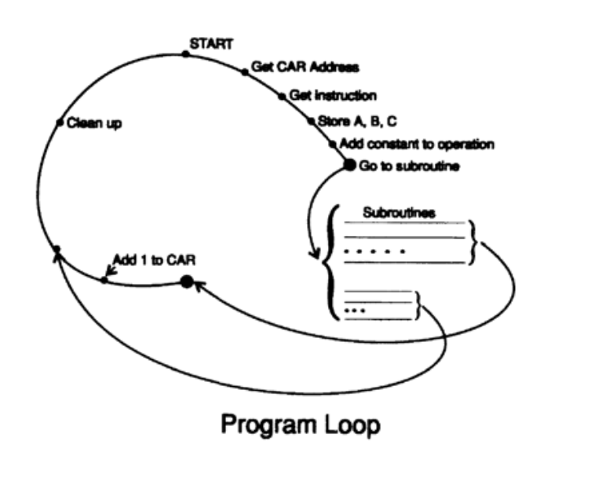

# 04-计算机简史-软件篇

我在上一章提到的，在计算机器制造的早期，都是手动控制。最初，缓慢的台式计算器由手动控制，例如乘法是通过重复加法实现的，每乘一位数后需要列移；除法类似，是通过重复减法实现的。后来，引入了电动机控制，可以更自动化地控制乘法和除法。穿孔卡机通过插板布线来告诉机器从哪里获取信息、如何处理以及将结果放在哪里（或在制表机上打印出来），但有时控制也可能来自卡片本身，通常是 X 和 Y 的穿孔（其他数字有时也可以控制发生的操作）。每项任务都会在插板上布一次线，在会计办公室中，这些布线板通常每周或每月循环使用，以适应会计的周期。

在斯蒂比兹制造了第一台复数计算机后，我们进入了继电器机器时代，这些机器主要由穿孔纸带控制。对于一次性问题来说，纸带是一种诅咒，很凌乱，很麻烦，还要通过粘贴来进行更正以及形成循环，因为胶水往往会渗进机器里的读数器。在早期，由于机器内部存储很少，程序无法被低成本存储在机器中，哪怕我相信设计师已经考虑过这种可能性。

ENIAC 最初（1945-1946年）通过布线进行控制，仿佛是一个巨大的插线板，但随着时间推移，尼克·梅特罗波利斯和迪克·克里平格将其改造成了一台从弹道表中编程的机器，这些表是巨大的拨盘架，程序的十进制数字以旋钮形式在这些拨盘上设置。

当存储合理可用后，内部编程也成为现实，虽然内部编程通常归功于冯·诺依曼，但他只是马克利和埃克特团队的顾问。据哈里·赫斯基称，在冯·诺依曼开始担任顾问之前，马克利和埃克特就经常讨论内部编程。阿达·洛夫莱斯夫人为巴贝奇分析机编写了一些程序，自这些程序发表之后，冯·诺依曼的陆军报告是广泛讨论的内部编程材料，这些报告传播广泛，但从未正式出版。

早期的代码主要是单地址码，每个指令包含一个指令操作，和一个操作数地址。我们还有双地址码，通常用于旋转磁鼓机器，这样在完成上一条指令后下一条指令就立即可用，这也适用于汞延迟线和其他串行存储设备。这种编码被称为最小延迟编码，程序员必须计算出将下一条指令和数据放在哪里，以尽量减少延迟和冲突，显然这就非常麻烦，尤其是在调试程序错误时更麻烦。在 IBM 650 机器上，后来提供了一个名为 SOAP（符号优化汇编程序）的程序，用于利用机器自身来进行这种优化。后来还有三地址和四地址代码，但我在此不做详细讨论。

关于 SOAP 有趣的一点是自我优化。SOAP程序 A 及其副本同时被加载到机器中，一份作为程序，另一份作为数据。程序A优化自身之后，输出一个程序，假如叫做程序 B。然后 B 再次被加载到 IBM 650 中，再读取A，（作为数据），运行后优化得到一个新的程序 B。两个程序 B生成所需时间的差异，就是 SOAP 自行优化了多少程序，这是一个早期自编译的例子。

一开始我们以绝对二进制编写程序，这意味着我们直接写出数据在内存中的实际地址，并且指令部分也是用二进制写的！为了避免这种方式，发展出两个趋势：一种是八进制，即将二进制数字按三位分组；另一种是十六进制，即每次取四位，并且需要使用 A、B、C、D、E、F 表示 9 以后的数字（当然还需要学习到 15 的乘法和加法表）。

如果你在修复一个错误时想插入一些新的指令，那么你会取前一条指令并将其替换为一个跳转指令，跳转到某个空闲区域。在那里你可以放入之前被跳转指令覆盖的指令，再添加你想插入的指令，然后再跟一个跳回主程序的指令。因此，程序很快就变成了一系列跳来跳去的控制路径。只要当更正中的指令有错误时，你就会再次使用相同的技巧，利用其他可用的空间，这种现象已司空见惯。因此，程序的控制路径很快就变得像一罐意大利面条一样复杂。为什么不直接在指令中插入它们？因为那样你就必须重新顺一遍整个程序，这就要改变所有被移动指令的地址！这是都不愿意做的事！

很快，我们就得有了可重用软件这个概念，这和现在含义一样。实际上，巴贝奇早就有这个想法了。我们编写了数学库，来重复使用代码块。但绝对地址的库意味着，每次使用库函数时，它都必须占用内存中的相同位置。当完整的库变得太大时，我们不得不转向可重定位的程序。所需的编程技巧记录在冯·诺依曼报告中，但这些报告从未正式出版。

第一本专门介绍编程的书由威尔克斯、惠勒和吉尔编写，适用于英国剑桥的 EDSAC（1951）。包括我在内的许多人从中学到了很多，稍后你们会听到我的一些经验。

有人想出了一个想法，可以编写一个短小的程序，用于读取操作符号名称（如 ADD），并在输入时将它们转换为二进制机器码（例如 01100101）。随后很快有人提出使用符号地址的想法——对于老一代程序员来说，这是一种真正的异端。如今，你很少见到早期那种采用绝对编程方式的英雄气概，现在只有使用手持可编程计算器，并尝试完成一些连设计者和制造商都想不到的任务时，才会采用绝对编程。

我曾经与贝尔电话实验室的一位女程序员合作了一整年，使用 IBM 701 的绝对二进制编码处理一个大问题，这台机器当时所有的32K 寄存器地址都已用尽。自那以后，我发誓再也不会要求任何人做这种工作。在听说了 Poughkeepsie（IBM制造基地）提供的符号系统后，我让她要一台，并在下一个问题上使用这个系统。如我所料，她反馈说这样做轻松多了。因此，我们向 IBM 食堂里所有人传达了这个新方法，大约 100 人，其中约一半是 IBM 的员工，另一半是跟我们一样来租用时间的外来户。据我所知，这 100 人中只有一个人——是的，只有一个人——对这个新方法表示有兴趣！

经过多年以后，我们最终设计出了一种更完整、更实用的符号汇编程序（SAP），真是难以置信花了这些年，在此期间，大多数程序员依旧慨然走在绝对编程的英雄之路上，坚持使用二进制机器码。当 SAP 首次出现时，我猜测大约 1% 的老程序员对它感兴趣，因为大家认为使用 SAP 的人是“娘炮”，真正的程序员不会浪费机器容量来进行汇编的。是的！程序员们根本不想使用它，尽管当被逼无奈时，他们不得不承认，老方法在定位和修复错误上比 SAP 程序要花费更多的机器时间。老一辈程序员主要吐槽是使用符号系统编程时，无法知道某个指令或数据在存储器中的具体位置，尽管在早期，我们其实提供了符号与实际存储的映射表，不管你信不信，他们真的会仔细研究这些映射表，并没有意识到，如果坚持在系统内部操作，他们其实并不需要知道实际存储。可是！在调试错误时，他们还是更喜欢使用绝对二进制地址。

FORTRAN，意为 FORmula TRANslation，由巴克斯和他的团队提出，这门语言再次遭到几乎所有程序员的抵制。首先他们认为这根本不可能做到。其次，即使做得到，也会浪费大量机器时间和容量。第三，即使它确实有效，也没有哪个正经程序员会使用它——那只是“娘炮”才用编程语言！

FORTRAN 跟早期的符号编程一样，在专业人士中推广得非常慢。几乎所有专业群体中这个现象都很常见。医生显然并不遵循他们给别人的建议，他们中也有相当比例的人是药物成瘾者。律师在死后通常也不会留下体面的遗嘱。几乎所有的专业人士在自己的工作中使用自己的专业知识都不是很积极。有一句古老的谚语很好地总结了这种情况：“鞋匠的孩子没有鞋穿。” 想想未来，当你成为一名伟大的专家时，你又将如何避免掉入同样的陷阱！

有了 FORTRAN 并运行之后，我告诉我的程序员用 FORTRAN 来解决下一个问题，先给程序改错，再测试一下看是否在正常工作，然后如果她愿意，可以用机器语言重写内部循环，从而提高运行速度，节省机器时间。结果，我们用了和之前差不多的投入时间，工作产出却是其他人的 10 倍。但对于他们来说，用 FORTRAN 编程不是“真正的程序员”的做法！

我们在纽约市 IBM 总部租用 IBM 701，管理非常糟糕，纯粹是对机器时间和人力的浪费（当时每小时 300 美元是很高的）。因此，我后来就没同意再订购一台大机器，一直到我想到办法给计算机增加一个监控系统才改变主意，最终有人为我们的第一台 IBM 709 增加了监控系统，后来又为 IBM 7096 增加了监控。

监控系统，我这些天常称之为“系统”，像我提到的所有早期步骤一样，按道理对于每天使用机器的人来说应该是显而易见要增加的；但大多数用户也许是太忙了，以至于无法意识到事情非常糟糕，更无法想到计算机还可以做什么就能使事情变得更容易和成本更低。注意到显而易见的事情往往需要置身事外，或者像我这样一个人，得善于思考，要觉察到自己在做什么，以及为什么需要这样。即使告诉了他们，老一代人也要坚持他们会的方法，可能是沉迷于过去，或不愿承认新方法比他们长期使用的方法更好。

纵观软件的历史，有一个特点就是，我们正在慢慢地从绝对机器向虚拟机器过渡。首先，我们摆脱了实际的代码指令，然后是实际的地址，接着在 FORTRAN 中消除了学习这些复杂机器内部结构及其工作方式的必要性。我们正在把用户与机器本身隔离开来。在贝尔电话实验室，我们很早就构建了一些设备，使得磁带单元成为虚拟的，与机器无关的。当且仅当你拥有完全虚拟的机器时，你才有可能将软件从一台机器转移到另一台机器而不会遇到几乎无穷无尽的麻烦和错误。

FORTRAN 的成功超出了所有人的预期，因为从心理学角度看，它的字面意思就是“公式翻译”，也是你在学校中一直习惯的方式，所以不需要学习一套新的思维方式。

Algol 大约在1958至1960年间得到许多全球计算机组织的支持，包括ACM。这是理论家们大幅改进FORTRAN的一次尝试。但由于他们都是逻辑学家，所以他们设计出了一种逻辑上很严谨，但从感受来说，对人却并不友好的语言，当然，显而易见，时间拉长来看，它已经失败了。它用布尔逻辑形式表达，其中很多部分对于普通人（甚至对于那些逻辑学家自己来说）都不好懂。也有许多其他基于逻辑的编程语言曾被认为会取代普通的FORTRAN，但都昙花一现，而FORTRAN（经过一定的修改）至今仍被广泛使用，这清楚地表明了从心理学角度设计的语言比从逻辑角度设计的语言更具优势。

这也是小众语言（即问题导向语言，简称POLs）井喷的起点。这个想法有一定的可取之处，但由于许多问题涉及多个具体领域，而这些语言通常互不兼容，因此这种热情逐渐消退。此外，从长期来看，这些语言的学习曲线陡峭，人们难以掌握可能需要的所有语言。

大约在1962年，LISP语言出现。关于它的由来有各种各样的传闻，真相可能是这样的：约翰·麦卡锡（John McCarthy）为了理论研究，提出了这门语言的基本元素，这个建议被他人采纳并显著扩展，当有学生发现可以用LISP本身编写一个编译器时，所有人都感到惊讶，连麦卡锡自己也惊讶。然而，他鼓励学生去尝试，几乎在一夜之间，他们就将理论实现成了一个真正能运行的LISP编译器！

我稍微扯点别的，谈谈我与IBM 650的故事。这是一台双地址鼓存储机器，以定点方式运行。根据过往的研究经验，我知道浮点运算的必要性（尽管冯·诺依曼可能不同意），并且我需要索引寄存器，而交付的机器中并没有这些寄存器。IBM公司曾承诺未来会提供浮点子程序，但对我来说还是不够。我曾为一本期刊审阅过EDSAC编程书籍，书中的附录D有一个奇怪的程序，能将大程序放入小存储空间中。它是一个解释器。但如果它只是附录D，他们真的理解这个程序的重要性了吗？我对此表示怀疑！后来，书籍出第二版了，这个程序仍然在附录D，显然他们都没有意识到它的实际意义。

这引出了我想讨论的一个复杂问题：怎么才算是真正的理解？你们看，他们写出了一个解释器，而且还使用了它，但他们真的理解了解释器和编译器的普遍性吗？我认为没有。大约在同时期，我们中的一些人意识到计算机实际上是符号处理机器，而不仅仅是数字计算器，我们到处做演讲，我看到人们在我讲到这里的时候频频点头，但我也意识到大多数人其实并没有真正理解。当然你可以说图灵在1937年的论文已经明确显示计算机是符号处理机器，但在仔细重读冯·诺依曼的报告时，尽管报告里有一个组合程序和一个排序程序，但你并不会觉得作者也意识到了这一点。

历史在这个问题上往往是仁慈的。历史往往认为对某事物的理解应该归功于最早实现它的人，而有一句谚语，讲得很有智慧：“几乎每一个开启新领域的人都不如后来人真正理解这个领域。”遗憾的是，这句话千真万确。据说，在物理学中，重要发明的创造者没有一个真正理解过他所做的事情。我发现爱因斯坦对狭义相对论的理解，不如后来的评论者那般清晰。而我的一个朋友也背着我说过：“汉明似乎不理解他发明的纠错码！”他可能是对的，汉明对汉明码的理解可能并不像他那样清楚。之所以常常出现这种情况，是因为发明者必须穿越许多黑暗的困境，经历大量的误解和混乱，以至于无法像后来人那样看得那么清楚。你们一定要记住这一点：发明者通常对其发明的视角非常局限，而其他人（可能是你们）则会看到更多东西。但是，如果你是某个辉煌新事物的作者时，也请你记住：你也逃不脱这个宿命。人们曾说，牛顿是最后一个古代人，而不是第一个现代人，尽管他在创造现代世界这件事的贡献上无可比拟。

回到IBM 650和我自己。大约在1956年，我开始设计一门语言，基于以下四个原则：

```
1.	易于学习。
2.	易于使用。
3.	易于调试（发现并纠正错误）。
4.	易于使用子程序。
```

最后一点现在可能并不需要你们关注，因为在那个时候，我们将“开放”子程序和“封闭”子程序区别对待，现在你们可能很难理解！

你可能会说我是自顶向下编程方式，但我首先写出了内循环的详细步骤，来检查它是否能够高效地运行（这属于自底向上编程），然后才继续进行自顶向下、哲学式的编程方式。因此，我既相信自顶向下的编程是一种很好的方法，我也清楚地认识到有时候自底向上的编程是必要的。

我让这台双地址、定点十进制机器看起来像是一台三地址的浮点机器——这是我的目标——A 操作 B = C。我使用了机器的十位十进制数字（就用户而言，它是一台十进制机器），形式如下：

| A地址 | 操作 | B地址 | C地址 |
| --- | --- | --- | --- |
| XXX | X | XXX | XXX |

这是怎么做到的？很简单！我在脑海中写下了以下循环，图4.I。首先，我们需要一个当前地址寄存器（CAR），所以我将IBM 650的2000个计算机寄存器中的一个分配给了它。然后，我们写了一个程序来执行上章提到的四个步骤。(1) 使用CAR找到下一个程序指令的地址（当然是用我设计的语言编写的）。(2) 然后将指令拆开，将A、B和C三个地址存储在650存储的合适位置。(3) 接着，将一个固定常数加到指令的操作（Op）部分，并跳转到该地址。在那里，每条指令都有一个描述相应操作的子程序。你可能认为我因此只有十种可能的操作，但三地址操作只有四种：加法、减法、乘法和除法，所以我使用0指令表示“到B地址去找需要执行的详细操作”。每个子程序完成后，将控制权转移到循环中的某个位置。(4) 我们随后将1加到CAR寄存器的内容中，清理一些细节，然后重新开始，就像原始机器在其内部操作中所做的一样。当然，传输指令（我记得是7指令）将一个地址放入CAR，并在循环中跳过增加1的部分进行传输。



图4.I 程序循环图

对这一过程的分析显示，无论您希望为指令赋予何种意义，必须编写与指令号对应的子程序。这些子程序定义了语言的含义。在这种简单情况下，每个指令的意义独立于其他指令，但显然可以很容易做到这样：使某些指令设置开关、标志或其他位，后续其他指令在查阅这些位时会以不同的方式解释。因此，您可以设计任何您想要的语言，只要您能以一种明确、唯一的方式定义好它。它的基础是机器语言，能将机器变成您想要的任何其他机器。当然，这正是图灵用通用图灵机所证明的结论，直到我们这样实践了好多次之后，才真正理解图灵的结论，我前面提到过，真正理解一个事物不容易。

我构建的软件系统位于存储寄存器1000到1999 之间的地址。因此，任何用合成语言编写的程序，只能引用地址000到999，无法引用或修改我软件中的任何寄存器，那样就破坏软件系统了；这样设计的目的就是保护软件系统。

我把这个过程描述得很详细，因为我们通常会在机器语言之上再构建一种语言，可能还会在其上构建几种更高层次的语言，如此一层层叠加，直到这个语言适合用来向机器表达我们的问题。如果在每一层都使用解释器，那么效率当然会有所降低。在最高层使用编译器意味着将最高层语言一次性转换为较低层语言，但可能在某些层次上仍盘需要解释器。这就意味着通常可以极大地压缩编程工作量和存储需求，和EDSAC的案例中一样。

我想再次强调编写逻辑语言和心理语言的区别。程序员们都倾向于编写和推崇逻辑语言，而很少从人的角度出发，这真是很不幸。也许最极端的例子是APL。从逻辑上看，APL是一种非常出色的语言，直到今天它还有狂热的追随者，但并不适合普通人使用。这种语言中有一种游戏叫做“一行代码”：给出一行代码，让你猜它的含义。即便是这种语言的专家，有时都错得离谱。

APL中一个字母的改变就可能完全改变代码的意义，可以说这种语言几乎没有冗余。但人类并不可靠，需要冗余；我们的口语冗余度大约是60%，而书面语言大约是40%。你可能认为书面语言和口语没啥区别，但其实并不是。为了看到这种差异，你可以试着写一个对话，然后读一下它的效果，几乎没有人能写出一段对话，使人听起来也很自然，而即使听起来自然，也并不等于口语。

我一直在强调，人类这种动物并不可靠，因此低冗余意味着存在大量错误，且不易检测出来，而高冗余则有助于捕捉到这些错误。口语通过声学通道传播，充满噪音，必须在谈笑间被对方理解，而书面语言是印刷出来的，你可以停顿、回看等方式来理解作者的意思。请注意，英语中不同的单词具有相同的发音（例如“there”和“their”）情况比较常见，反而相同的拼写但发音不同（例如名词“record”和动词“record”，以及“tear”可以指眼泪或撕裂）则少见。因此，评价一种语言，要看它如何适应人类本身，当然要记住我所说的人类是已经在学校受过训练的人，否则就必须准备进行大量培训，才能掌握一种新类型语言。对计算机专家来说容易的语言，对非专家来说不一定容易，而在不久的将来，很可能大部分编程工作是由非专家承担，这类工作当然也可以称之为编码工作。

从长远来看，最好是提出问题的那个人能亲自编写代码，而不是像现在常见的那样，提出问题的人和懂得编程的人不是同一个。不幸的是，这一天离现在还很远，无法立即产生很大的影响，但我认为，到2020年，领域专家自己编程将会成为常态，而不是由计算机专家（对应用领域一无所知的人）编程。

我认为， ADA语言是由专家设计的，且所有由专家设计导致的不人性化特征暴露无遗。这是一种典型的计算机科学“黑客”作品，不要试图让别人理解你在做什么，只要运行就行。因此，由于这种糟糕的体验设计，我私下对一些有识之士做过调查，调查结果表明，哪怕政府合同规定了编程语言只能使用ADA，但实际上大约超过90%的工作是用FORTRAN完成的，经过调试和测试后，再由手工转换为糟糕的ADA程序，过程很痛苦不说，而且还有很高的错误率！

至今我们仍然没有完全理解语言的本质。在1950年代初期的某个时候，我带了一位当时公众眼中的自然语言专家参观了IBM 701，然后一起吃午饭。在吃甜点时我说：“Pei教授，您能否和我们讨论一下语言的工程效率？”他根本没有理解我这个问题，不断谈论这就某种语言是如何将复数放在词语中间的，某种语言具有什么特征而不是另一个特征等等。而我关心的是，当我们有能力设计一种语言时，使用语言沟通的一边是有各种缺点的人类，另一边是一个机器，能高可靠地执行指令但除此之外不做任何事，要高效地完成人机之间的沟通，这种语言应该有多少冗余，不规则和规则动词密度应该是多少，同义词和反义词的比例是多少，以及为什么是这些数量，如何做到高效地压缩通信通道又能保留足够的人类冗余等等。正如我所说，他根本听不懂关于语言工程效率的问题，之后我也没有注意到有太多的研究在这方面进行。假设当前自然语言通过长期进化已经相对适合人类的沟通了，除非我们真正理解这些问题，否则我们将无法设计出适合人机通信的人工语言。因此，在我们理解人类通过自然语言沟通的原理之前，我预计还会遇到很多麻烦。当然，人机之间的问题与人类之间的沟通明显不同，但具体在哪些方面不同，以及差异有多大，似乎都还不清楚，甚至没有人对此进行研究。

在我们更好地理解人类的沟通语言之前，或者可以容易地进行训练之前，我们的软件问题可能会一直存在。

前不久，日本计划使用“第五代”计算机，并结合AI，来改进机器和人类之间的接口。这对机器和编程语言都提出了很高的期望。到目前为止机器符合预期，但他们不得不重新设计机器，希望利用AI来辅助编程。这和我当时（为洛斯阿拉莫斯）所预测的一样，因为我没有看到日本人在语言的工程问题上有任何理解。我们可以做很多事情来减缓所谓的“软件问题”，但只要我们没有真正理解人类之间，以及人机之间如何通过语言进行理解交流，我们就无法对这一成本高昂的问题找到真正合理的解决方案。这一问题根本不会消失。

你经常会读到“软件开发的工程化”这样的话题，有的是关于提高生产效率，有的人关于提高产品的可靠性。但是你不会指望小说家去“工程化地生产小说”。那么，问题来了：“编程是更接近于创作小说，还是更接近于经典工程学？”我的建议是，更接近创作小说！如何让人类进入太空，俄罗斯人和美国人总体上采用了相似的方法，当然其中存在一些间谍活动，因为他们都受限于同样的物理定律。但如果给两位小说家同一个主题“人类的伟大和悲惨”，你可能会得到两部完全不同的小说，先不论水平。同样，给两个现代程序员一个复杂的问题，你会得到两种截然不同的程序。这就是为什么我认为当前的编程实践更接近于小说创作而不是工程学。小说家只受想象力的限制，程序员在编写软件时的情况类似。两种活动都具有很大的创造成分，尽管你可能希望使编程更像工程学，但要实现这一点还需要很长时间，也许从长远来看，你其实并不希望这样做！也许它只是听起来美好而已。在未来的许多年里你一定得好好想想这个问题，你现在就不妨开始思考，别信听到的宣传，也别信这一领域所有的美好想法！计算机的实用程序软件已经完成过很多次了，加上适用范围又非常有限，因此这种软件“被工程化”就比较合理，但普通的软件编写在很长时间内不太可能受到“工程控制”。

关于如何提高程序员个人以及团队的生产力，有很多建议。我已经提到过自顶向下和自底向上的编程，还有其他诸如首席程序员、核心程序员、数学意义上的程序正确性证明、瀑布模型等。虽然每种方法都有其优点吧，但我相信一种方法，几乎没人提到过的方法，那就是在写程序之前好好思考。在开始写程序之前，仔细考虑整个事情，包括如何进行测试，以及将来如何维护。第一次就做对总比事后修复要好得多！

编程的诸多问题之一是通常一开始任务并不明确，而是一边编程，一边逐渐发现问题是什么！希望在你开始编程之前就有明确定义的问题，但往往事与愿违，因此，很多目前“解决编程问题”的提议如果严格执行的话都落不了地。

高级语言的使用本身就意味着提效很多了。这30年来，累计改进的估算倍数是：

| 改进类型 | 累计改进倍数 |
| --- | --- |
| 汇编：机器码= 2:1 | ×2 |
| C语言：汇编 = 3:1 | ×6 |
| 分时：批处理 = 1.5:1 | ×9 |
| UNIX：监控程序 = 1.5:1 | ×12 |
| 系统质量保证：调试 = 2:1 | ×24 |
| 原型设计：自顶向下 = 1.3:1  | ×30 |
| C++：C = 2:1 | ×60 |
| 程序复用：重新编写 = 1.5:1  | ×90 |

所以我们显然在30年内在程序员的总体生产力上提高了大约90倍（仅16%的年增长率！）。这是我个人的猜测，应该是可信的。但是与机器速度的提高比起来，这就是九牛一毛！人们希望人类也能相应地加速，但根本的瓶颈在于人类这个动物本身就是现在这样子，而不是我们希望的那样子。

许多研究表明，程序员在生产力上存在巨大差异，最差与最好的相差超过10倍。因此，我很早就断言过，只要你做得到，那么最佳策略是给优秀程序员丰厚的薪酬，同时定期开除能力较差的程序员！当然，不开除也行，把他们转为外包员工，但这在法律上越来越不可行，法律希望确保每一个人都有同样的就业机会。实际上，还有一个做法也会更好，那就是让最差的程序员待在家里，别来公司打扰优秀程序员工作（我是认真的）！

如今，数字计算机已被广泛用于模拟**神经网络**，这类设备正逐渐进入到计算领域。如果你不熟悉神经网络的话，可以理解为：它可以从你给它一系列输入和对应的合理输出中**学会**，如何从这个过程中得到结果，而不必明确告诉它计算过程。它们可以将对象分类为正确的类别，同样不需要告诉它分类的规则。它们通过简单的反馈来学习，一旦根据输入计算得到的结果不是预期结果时，就形成一个反馈。某种程度上，它们代表了“编程问题”的一种解决方案：一旦构建出来，它实际上并没有被真正编程，但仍能把各种问题解决得令人满意。这是一个正在兴起的领域，未来可能在计算机中扮演重要角色，但是我这里就不着重讲解了。从某种意义上说，神经网络就是一种“硬连线”的计算机（其实只是一个程序），在选择合适的参数并学习大量的数据后，就可以解决很多不同的问题。

关于神经网络，还有另一种看法，说它代表了一类相当普遍的稳定反馈系统。选择你认为合适的反馈类型和数量，然后神经网络的反馈系统会收敛到所需的解决方案。同样，它避免了大量的细节编程，至少在计算机上模拟过的神经网络中，一旦写出一个非常通用的神经网络程序后，就相当于获得了一类问题的编程解决方案，而程序员只需按需调用它们即可。还有哪些非常通用的编程模块可以做到这样呢？目前似乎还不清楚，你可以考虑把神经网络作为解决“编程问题”的一种可能方案。

在硬件那一章中，我详细讨论过一些硬件的限制因素——分子大小、光速和散热，所以为了呼应，我也应总结总结限制软件的不确定因素。

我对比一下编写软件与创作文学：两者都有赖于清晰的思维。良好的编程能被教会吗？我们不妨参照一下“创意写作”课程，会发现大多数参加这类课程的学生并没有成为伟大的作家，而历史上大多数伟大作家也没有上过创意写作课程！因此，很难相信可以轻易培训出伟大的程序员。

经验有帮助吗？比如官员们经年累月地撰写报告和下达指令，写作会变得越来越好吗？我没有真实的数据，但我怀疑他们随着时间的推移会变得越来越差！多年“八股文”经验可能会变成他们的写作风格，这就使他们的写作变得越来越糟糕。我对程序员也有同样的怀疑！编程经验足够久，会用的编程语言数量多，都不意味着程序员水平比别人好。你看看编程书籍就知道了，大多数作者并不是好程序员！

我说的话可能不好听，你可以说出好听的话，描绘出美好的画面来反驳我，但我经历的编程历史可是很悠久的！