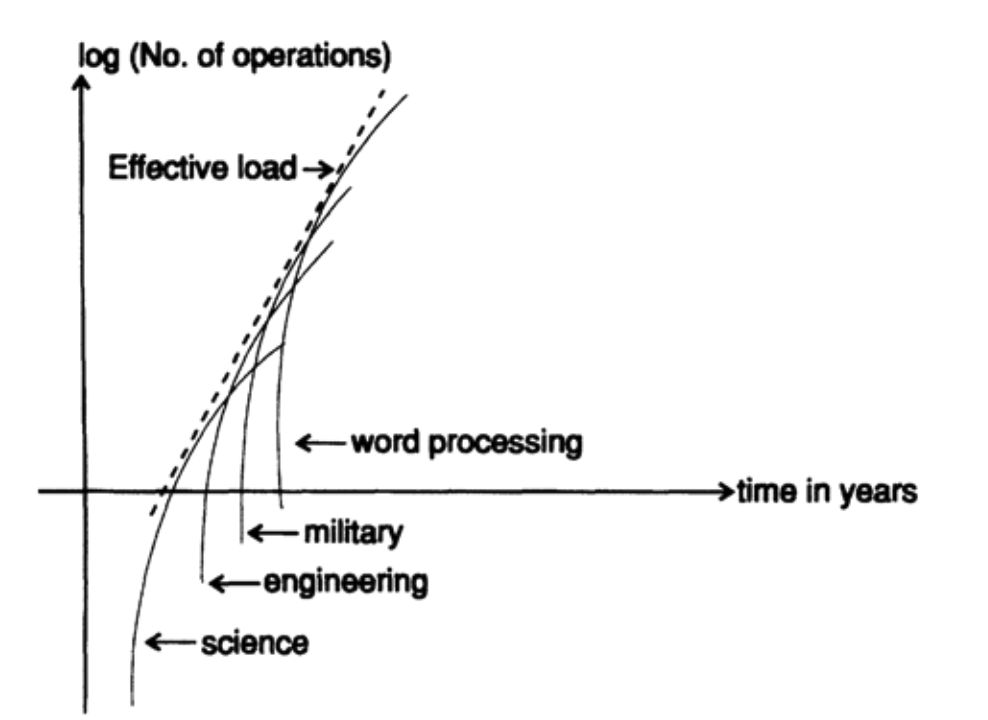

# 05-计算机应用简史

你可能已经注意到了，我正在用一些技术类素材把很多轶事串联起来，接下来我也将从一个故事开始，讲述这一章以及前两章是如何写出来的。在20世纪50年代，我发现自己害怕给大量观众做公开演讲，哪怕我多年来一直在大学教授课程。在对此进行了非常认真的思考后，我得出结论：如果我想成为一位伟大的科学家，我就不能让这种恐惧阻碍自己，作为一名科学家，责任不仅是发现新事物，还要至少通过三种形式成功地传达这些成果：

```
•	撰写论文和书籍
•	准备好的公开演讲
•	即兴演讲
```

上述任何一种技能缺乏都会对我的职业生涯造成严重阻碍。如何克服在公开演讲时的恐惧，这是我的问题。答案显然是通过实践，尽管其他事情可能有帮助，但练习是必要的。

在意识到这一点后不久，我正好有机会在一个晚上做演讲，对象是一群学习使用 IBM 机器的 IBM 客户们。作为用户，我自己也参加过类似的课程，通常这种培训要安排一周工作日。IBM 在晚上提供娱乐活动，通常安排第一晚有聚会、某个晚上去欣赏戏剧，还有一个晚上则是关于计算机的通识讲座，很显然，他们安排我的就是这个讲座。

我立刻接受了这个邀请，因为这对我来说是一个难得的实践机会，我也刚刚反思了，自己必须要锻炼演讲能力。我很快决定，我应该好好准备，来一场非常出色的演讲，这样我才能被邀请做更多的演讲，从而得到更多的练习。最初，我想做一个自己感兴趣的话题，但我很快意识到，如果我还想有下次，那最好选择一个听众想听的话题，而这通常是非常非常不同的事情。他们会想听什么？我并不知道他们所参加课程的具体内容，也不知道这些人的水平。于是，我决定做一个具有普遍兴趣的话题——《到 2000 年的计算发展史》，而那时大约是 1960 年。即使是我自己，对这个话题也很感兴趣，也想知道自己会说什么！此外，在准备这个演讲的过程中，我也在为自己的未来做准备，这很重要。

当说到“他们想听什么”时，我不是政治家的身份，而是作为一个科学家，应该讲出他们所认为的真相。科学家演讲也不应停留在有趣好玩，因为演讲的目的是把科学信息从演讲者传递给听众。但这并不意味着科学演讲就一定枯燥乏味。科学传播与纯娱乐之间有一条细微但明确的界限，科学家应该始终站在那条界限的正确一侧。

我的第一次演讲主要讲了硬件方面的话题，讨论了硬件的限制，包括在第三章中那三个相关的自然规律：分子的大小、光速和热耗散问题。我还设计了一些精美的彩色VuGraphs幻灯片，展示了量子力学的限制，包括不确定性原理的影响。这次演讲非常成功，邀请我演讲的IBM员工事后反馈说观众都很喜欢。我随口说到：我自己也很享受，如果他们愿意，我可以在任何一个晚上再来纽约市给他们做一次演讲，只要提前通知我就行。他们同意了。就这样，这成了系列演讲的第一次，这个系列持续了很多年，每年两到三次；我得到了大量的练习，并学会了客服恐惧。在演讲时，你本人也应该保持一定的兴奋，即使是最优秀的男演员和女演员通常都会有一些舞台恐惧感。如果你兴奋了，就会感染到观众，如果你表现得非常放松，观众也会放松下来，甚至可能会打瞌睡！

这个演讲还让我保持与时俱进，密切关注着计算的趋势，同时在智识上也有收获，使我成为了一位更加成熟的演讲者。这并不全是运气，是我通过尝试理解事情背后真相而获得的。在任何我参加的演讲中，我不仅关注所讲内容，还会关注演讲的风格，以及是否是一场有效的演讲。那些只搞笑的演讲我往往会忽略，但我也会认真研究讲笑话的风格。一个晚宴演讲通常需要三个好笑话：一个在开头，一个在中间，一个在结束时，这样他们至少能记住一个笑话，当然三个笑话都要讲得很好才行。我不得不找到自己的讲笑话风格，我就常常给秘书们讲笑话，练习自己的风格。

在做了几次演讲后，我意识到，到了2000年左右，计算的发展同时受硬件和软件的限制，这正是我在上一章刚刚讲到的内容。又经过很长时间思考，最终我意识到，可能会是经济，会是应用层在主导着计算机的演变。有很多事情，尽管不是所有事情，都必须在经济上合理。因此，本章就讨论这个话题。

计算始于简单的算术，在天文学上有了大量实践，现在发展到大规模的数值运算。值得一提的是，雷蒙德·卢尔（1235–1315），有时写作Lully，是一位西班牙神学家和哲学家，他造了一台逻辑机器！斯威夫特在《格列佛游记》中讽刺过这台机器，书中格列佛在拉普达岛上。而我总觉得书中的拉普达岛影射的正是马略卡岛，因为卢尔活跃在马略卡岛。

在现代计算的早期，大约在20世纪40年代和50年代，“数值运算”占据着主导地位，因为当时只有那些想要获得确切、可靠数字的人才有足够的资金支付高昂的计算费用。随着计算成本下降，我们在计算机上能开展得起的事情也涉及到其他许多领域了，不再局限在数值运算。我们一直都知道这些事情是可能的，只是原来它们在经济上不可行。

我在计算方面的另一个典型经历是这样的：在洛斯阿拉莫斯，我们用原始设备求解偏微分方程（描述原子弹的行为）。在贝尔电话实验室，我最初在继电器计算机上求解偏微分方程，其实我甚至还解过偏微分-积分方程！后来，随着更好的机器出现，我开始求解导弹轨迹形式的常微分方程。再后来，我发表了几篇关于如何进行简单积分的论文，之后又发表了一篇关于函数评价的论文，最后还写了一篇关于数字如何组合的论文！是的，我们在最原始的设备上搞定了一些最困难的问题，这样做是想证明机器可以完成那些人工无法做到的事情。只有这样，那些现在只能通过手工费力完成的问题，我们才能找到更经济的解决方案！为此，我们需要发展适合机器的数值分析基本理论和实际计算方法，而不是就一直做手工计算。

这在很多情况下是典型的。首先必须毫无疑问地证明新的事物、设备、方法或其他什么东西，它们的确可以应对艰巨任务，然后它才能进入原有系统，变成常规手段处理那些从长远来看更有用的任务。任何创新总是要面对这样的障碍，所以当你发现你的新想法遭到强烈的抵制时，哪怕抵制可能很愚蠢，你也不要气馁。你要先认识到任务的实际规模大小，再决定是否值得继续努力，或者你是否应该去做其他更有可能成功的事情，而不是和惯性和愚蠢做无谓的对抗。

在计算机的早期演变中，我很快转向了在一台大机器上处理许多小问题。我意识到，在某种非常现实的意义上，我是在进行一种可变产品的批量生产——我应该组织好一切，以便能够应对接下来一年可能出现的大部分问题，同时又不知道这些问题的具体细节。那时我意识到，计算机会使形形色色可变产品的批量生产成为可能，不论是数字、文字、文字处理，还是制作家具、编织等。它们使我们能够在不进行过度标准化的情况下处理多样性，因此我们可以更快地进化到想要的未来！你现在可以看到，这个理念已经被应用到了生产计算机自身上！计算机在人类的指导下设计芯片，计算机也是经由标准零件自动地组装起来的，你说出你想要什么样配置的计算机，然后这样配置的计算机就会被制造出来。一些计算机厂商现在几乎完全通过机器组装零部件，几乎没有人类干预。

我将自己视为可变产品批量生产流程的一环，正是这种态度使我以上一章提到的那种方式处理 IBM 650。1人年的总工作量我们在 6 个月的时间内完成了，这样一来我发现年末完成的工作比依次解决每个问题的方式要多得多！我们开发的软件工具在一年内就得到了回报！计算机软件是一个快速变化的领域，如果近期得不到回报，那么它最终是否会有回报就不好说了。

我忽略了我在科学和工程领域之外的经历，例如，我曾在纽约市用 UNIVAC-I 为 AT&T 解决了一个非常大的商业问题，以后有机会我再谈谈当时学到的教训。

我们来用更量化的方式讨论计算机应用。因为我在贝尔实验室的研究部门，最初的问题自然主要是科学性的，但由于我们是在贝尔实验室，我们很快就开始解决工程问题。首先，如图5.I所示，纯科学问题的增长呈指数上升（注意垂直的对数刻度），但很快你就会看到S曲线的上部，即增长率趋于平稳的部分。毕竟，我当时解决的问题类型和贝尔实验室雇佣的科学家总数都是有限的，所以他们能够提出和消化的问题也是有限的。你们知道的，他们开始提出更大规模的问题，虽然速度放缓了，所以科学计算仍然是计算机使用中的一个重要组成部分，但在大多数情况下，已经不再是主流应用了。



图5-I

工程计算应用也很快跟了上来，其增长形态类似，但规模更大，叠加在早期的科学曲线之上。在贝尔实验室，我发现还有更大规模的军事类应用，最后当开始转向到符号操作应用，如文字处理、高级语言的编译等，也出现了类似的增加。因此，虽然每类工作负荷似乎都逐渐趋于饱和，它们的整体效果是维持了一个相对稳定的增长率。

如何维持这种直线对数增长曲线，避免应用领域增长的S型曲线宿命呢？我认为下一个重要领域是模式识别。我怀疑我们是否有能力处理最普通的模式识别问题，因为涉及的内容非常广泛，但在语音识别、雷达模式识别、图像分析和重绘、工厂和办公室的工作负载调度、统计学家用的数据分析、虚拟图像的创建等方面，我们能消耗大量的算力。虚拟现实计算将成为算力的消费大户，它有明显的经济价值，所以它的增长指日可待，这包括实用需求，也包括娱乐需求。此外，我认为人工智能也是算力大户，最终它提供的服务和它消耗的算力会在经济上匹配，因而会成为另一种解决S型增长问题的出路。

我们很早就启动了交互式计算。一位名叫杰克·凯恩（Jack Kane）的科学家启蒙了我。当时他有一个大胆的想法，就是将一台小型科学数据系统（SDS）910计算机连接到布鲁克海文（Brookhaven）的回旋加速器上，这台设备我们使用的时间很多。我的副总裁问我杰克能否做成，于是我仔细研究了这个问题（也研究杰克）后，我说他可以。接着副总裁又问：“造这台机器的公司不会垮了吧？”，因为副总裁不希望机器得不到售后支持。这个问题又让我忙活了更久，最后我和SDS的总裁约在洛杉矶的办公室当面谈一下。谈完后我认为可以做，但这个以后再说。于是我们真的做了，我当时相信，现在也仍然相信，这台廉价的小型SDS 910使昂贵的巨大回旋加速器有效生产力至少翻了一倍！在回旋加速器运行时收集、缩减数据并在小示波器上显示数据，它无疑是首批计算机之一（这台示波器是杰克在几天内组装并运行起来的）。这使我们能够及时停掉许多不太合适的实验，比如样本没有完全位于光束的中心，或者在光谱的边缘有某种效应，因此我们需要重新设计实验，或者有些不对劲的情况需要定向获取更多的细节，所有这些都可以让我们停止和修改实验，而不是非得把实验做完才发现问题。

这一经验促使我们在贝尔实验室安装小型计算机，最初仅用于收集、处理和显示数据，但很快就用来驱动实验。通过标准的数模转换器，让机器来编程驱动实验的电压形状，往往比构建专用电路要容易得多。这极大地扩展了可能实验的范围，并引入了交互式实验的实用性。还是那样，我们最初引入计算机的理由并不多，但从长远来看，机器的存在改变了问题的性质和计算机实际的用途。成功使用计算机时，通常是做了等价的工作，而不是和原来一模一样的工作。你会看到，拉长时间尺度，计算机改变了许多实验的性质。

后来波音公司（西雅图）也有类似的想法，即他们会在磁带上保持一架拟设计飞机的当前状态，并让所有人都使用那条磁带，这样在设计特定飞机的过程中，公司各部分都能够彼此协调。然而，事情并不像老板们预期的那样发展，或者说至少不像他们所认为的那样！我怎么知道的呢，因为我当时假借为一个低层小组进行例行检查的名义，为波音高层进行了一次为期两周的高层次秘密调查！

它未能按计划运行的原因很简单。如果设计的当前状态保存在磁带上（现在是光盘），当你在研究机翼的面积、形状和轮廓时要使用这些数据，那么你改一些参数并发现有效果时，有可能是因为有人对公共部分进行了修改，而不是你自己改动带来的，你的改动实际上可能使设计更差了！因此，实际情况是，每个小组在进行优化研究时，都会制作一份当前磁带的副本，从而在没有任何其他部门做更新的情况下使用这些副本数据。只有当他们最终确定了新的设计时，他们才会提交这些更改，当然，他们还必须要验证新设计与公共部分的新设计是否有冲突。总之，你无法在一个不断变化的数据库上进行优化研究。

这让我想到了数据库这个话题。计算机曾被视为这一领域的救星，至今人们仍时不时地寄希望于它们。航空公司在计算机上运行机票预订系统就是一个很好的例子——想象一下，如果这全部由手工完成，会多么混乱，何况还会碰到人为错误以及由此引发的种种麻烦。而现在，航空公司保存着许多数据库，包括天气信息。在起飞前，每次航班的飞行路线都是根据天气状况和当前的机场延误情况设计的，并且有可能在飞行中根据后续信息进行调整。

公司管理者似乎总有一种幻想，如果他们能掌握公司的全部最新细节，管理就可以更好。因此，他们认为必须拥有一个包含公司所有活动的实时数据库，但这存在着前面提到的困难。另外，假设你和我都是公司副总裁，并且在周一早上的会议上需要完全相同的数据。你在周五下午运行程序获取了数据，而我比你聪明，知道有许多信息会在周末从其他分支机构传来，因此等到周日晚上，我才准备数据。很明显，即使我们都使用了相同的程序来准备报告，我们两份报告之间的差异也很显著！这在实际操作中是无法容忍的。此外，最重要的报告和决策也不应该过分依赖实时数据。

那么科学数据库呢？例如，谁的测量数据能存进数据库？显然，数据被纳入其中会带来个人声望，因此不可避免地会有激烈、昂贵且恼人的利益冲突。这些冲突如何解决？只能付出高昂的代价！同样，当你进行优化研究时也会遇到波音公司的问题：新模型比旧模型更好，会不会是因为某些物理常数的变，而你并未察觉？如何让所有用户都了解到那些已经变更的状态？要求用户在每次使用计算机时要先阅读所有相关材料，仅这一点根本不够，因为材料不会保持更新，从而导致错误的发生。批评用户也无济于事！

我最初主要讨论的是通用计算机，但我逐渐开始讨论将通用计算机作为专用设备使用，比如控制回旋加速器和实验室设备等。某个时候集成电路制造商发现，与其为多个客户分别制造专用芯片，不如制造一个四位通用计算机芯片，然后为每个特殊任务专门编程（就是INTEL 4004），这是一次重要的进展，用编程工作取代了复杂的制造过程。当然，芯片仍然需要制造，但改进后就可以批量生产四位芯片。这再次验证了我多次提到的趋势：从硬件转向软件，都用相同的通用计算机编程，才能实现可变产品的批量生产。四位芯片很快扩展到八位、十六位，等等，现在有些芯片上甚至装有六十四位的计算机！

你可能没有意识到，在一天中你会与多少计算机产生互动。交通信号灯、电梯、洗衣机、电话（如今电话中内置了许多计算机，而在我还年轻时，电话线路另一端总是有一个乐于助人的接线员帮你找到所需号码）、电话答录机、由计算机控制的汽车等，都是计算机应用范围不断扩大的例子，你只需仔细留意，就能发现在你生活中到处都有计算机的身影。当然，随着时间的推移，计算机的数量会进一步增加，因为同一台简单但通用的计算机可以执行那么多专用任务了，以后专用芯片都会很少需要。

你会看到周围有很多专用芯片，根本不需要这么多。这是为什么呢，独占专用芯片而不是普通的通用芯片，会给自己带来很大的满足感（我在第2章中就说过）。你如何避免也犯这个错误呢，那就在任何设备中要使用专用芯片之前，先问自己几个问题（我再啰嗦一下）：你想要独自使用你的专用芯片吗？这样的话，你要在库存中储备多少这样的芯片？只能从少数几个供应商那里购买这样的芯片，或者能够在公开市场上随时购买芯片，你选哪个？从长远来看，专有芯片的总成本显著更高，不是吗？

如果你使用的是通用芯片，那么所有用户都可能做出贡献，比如一起发现芯片的缺陷，这样一来制造商就会非常愿意去修正，否则你就必须自己编写手册，自己写诊断程序，等等事情都得自己做，与此同时，其他人在芯片使用上积累的知识，根本帮不上你。而使用通用芯片时，芯片升级（通常由其他人处理）也会对你开放，不需要你花费额外的努力。你肯定会面临着要升级芯片，因为你很快会有超出原计划的新需求出现，而在满足新需求时，通用芯片要容易得多，因为它往往具有扩展性，带有一些面向未来的冗余能力。

你不需要我帮你列出计算机在你业务中有哪些应用，你比我更清楚，计算机的使用肯定在迅速增加，不仅在一线会使用，而是从高层到底层的整个组织，从后方到前线的整个生产制造环节。你也应该非常清楚，更新升级的高频率，通用符号处理设备的灵活性，让整个组织可以应对不断变化的运行环境。计算机的应用范围才刚刚开始，许多新的应用有待开发，也许就是你来实现的。对于已经存在的事物做微创新确实也不错，但我也期待你能做出伟大创新，使你的组织发生巨大变化，这些变化会在历史中被铭记若干年。

在你职业生涯中，你应该审视哪些应用成功了，哪些失败了，试着学习如何区分它们，试着理解哪些情况会带来成功，哪些情况几乎注定会失败。我常常说，你不应该用机器去复刻手工工作，而是做一个与之等效的工作，还要考虑将来可以轻松地扩展（如果应用成功的话），而且始终要认真考虑未来现场的维护工作，因为机器通常不会按你希望的方式运行！

计算机在社会中的应用远没有饱和，还有大量新的、重要的机会。发现机会比大多数人想象的要容易！

在前两章的结尾处，我提到了一些有关硬件和软件可能限制的话题。同样我也要讨论应用方面的可能限制，那就是接下来几章中的内容，我会以“人工智能”（AI）为总标题。